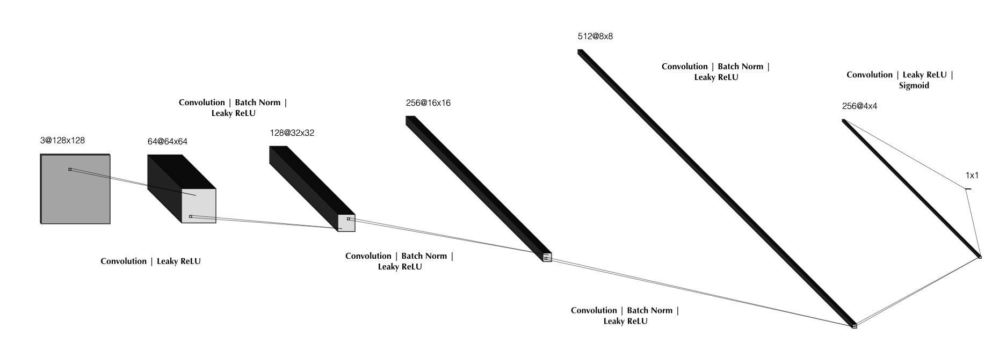
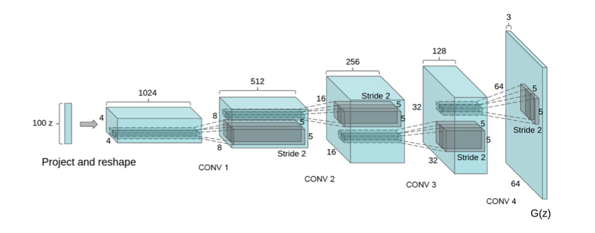
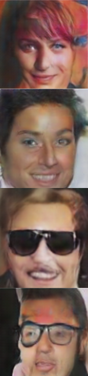
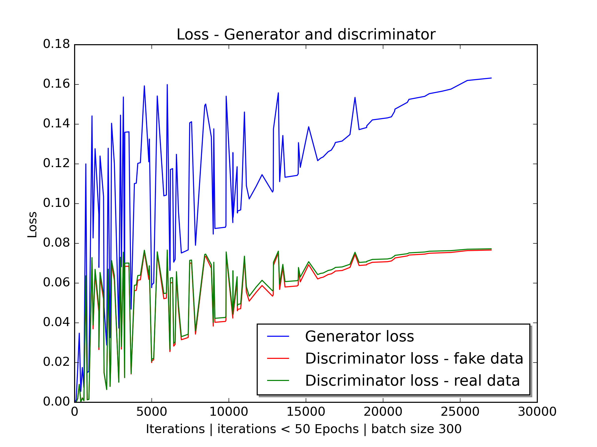

# Generative adversarial networks

Generative adversarial networks consist of two neural networks

1. Generator: A neural network that produces an image from random noise.
2. Discriminator: A neural network trained to predict a conditional probability $p(real | data)$.

These networks are trained simultaneously, so that the discriminator recognizes the underlying distribution of the training data, and the generator produces real samples which the discriminator considers to be real.

## DCGAN

The gan implementation in this repository is based on the paper [Unsupervised Representation Learning with Deep Convolutional Generative Adversarial Networks](https://arxiv.org/abs/1511.06434) with added convolutional layers to scale the produced images to 128 x 128 and hyperparameter modifications.

## Dataset
The dataset used is [CelebA Dataset](https://mmlab.ie.cuhk.edu.hk/projects/CelebA.html) consisting of over 200,000 celebrity faces. The transformations used are central cropping to obtain the desired image size and normalization.

## Architecture - Discriminator

The discriminator consists of a convolutional neural network operating on 3 x 128 x 128 images. Batch normalization in all but the first and last blocks. Leaky rectified linear units are used in all the blocks. To predict $p(real | data)$, a sigmoid activation is used.

    
    <figcaption>Discriminator Architecture</figcaption>

The discriminator is trained to predict the conditional probability $p( real| data)$ indicating if the data is real or generated by the second neural network the generator.

## Architecture - Generator

The generater takes as input a noise vector and uses transposed convolutional layers to project feature maps into a higher dimensional feature space.

    
    <figcaption>Generator example architecture | DCGAN paper</figcaption>

## Results - Generated Images

The figure below displays the samples produced by the generator throughout the training process.

    
    
    <figcaption>Generator samples</figcaption>

## Optimization

The optimization objective of generative adversarial neural networks was first described in the paper [generative adversarial network](https://proceedings.neurips.cc/paper_files/paper/2014/file/5ca3e9b122f61f8f06494c97b1afccf3-Paper.pdf).

It is the mini max defined by

$\underset{G}{min}\ \underset{D}{max}\ V(G, D) = \underset{G}{min} \ \underset{D}{max} \ (\mathbb{E}_{x \sim p_{data}}[log(D(x))] + \mathbb{E}_{z \sim p_{z}}[log(1 - D(G(z)))] )$

Where $x$ represents the real images and $z$ the noise used by the generator to produce fake images. The minimax is achieved when the distribution $p_g$ of the fake images matches the distribution of the real images $p_{data}$

We have that:

$V(G, D) = \int_{x \sim p_{data}} p_{data}(x) \ log(D(x)) \ dx + \int_{z \sim p_{z}} p_{z}(z) \ log(1 - D(g(z))) \ dz$

$V(G, D) = \int_{x \sim p_{data}}  p_{data}(x) \ log(D(x)) \ dx + \int_{x \sim p_{g}} p_{g}(x) \ log(1 - D(x)) \ dx$

$\underset{D}{max}\ V(G, D)$ is attained at $D^* = \frac{p_{data}}{p_{data} + \ p_{g}}$

$\underset{G}{min}\ \underset{D}{max}\ V(G, D) = \underset{G}{min} \ \ (\mathbb{E}_{x \sim p_{data}}[log(\frac{p_{data}(x)}{p_{data}(x) + \ p_{g}(x)})] + \mathbb{E}_{x \sim p_{g}}[log(\frac{p_{g}(x)}{p_{data}(x) + \ p_{g}(x)})] )$

defining $KL$ as the  Kullback–Leibler divergence between distributions $P$ and $Q$ where $Supp(P) \subseteq Supp(Q)$ to be $KL(P||Q) = \mathbb{E}_{x \sim P}ln \ \frac{P(x)}{Q(x)} >=0$

$\underset{G}{min}\ \underset{D}{max}\ V(G, D) = \underset{G}{min} \ \ (-ln(4) + KL(p_{data} \  || \frac{p_{data} + p_{g}}{2}) + KL(p_{g} \  || \frac{p_{data} + p_{g}}{2}))$

$\underset{G}{min}\ \underset{D}{max}\ V(G, D) = \underset{G}{min} \ \ (-ln(4) + 2 \ JSD(p_{data} \  || p_{g}))$

where $JSD$ is the Jensen–Shannon divergence between two probability distributions $Supp(P) = Supp(Q)$ defined as $JSD(P||Q) = \frac{1}{2}(KL(P||Q) + KL(Q||P)) >=0$

Therefore the minimum over $G$ is attained if $p_{data} = p_g$

## Training

The network was trained for 50 epochs on the entire celebA dataset. The figure shows the loss function of the discriminator when given samples both from $p_g$ images generated by the generator network and samples from the training data $p_{data}$

    

#### References

1. [generative adversarial network](https://proceedings.neurips.cc/paper_files/paper/2014/file/5ca3e9b122f61f8f06494c97b1afccf3-Paper.pdf)
2. [Unsupervised Representation Learning with Deep Convolutional Generative Adversarial Networks](https://arxiv.org/abs/1511.06434)
3. [A guide to convolution arithmetic for deep learning](https://arxiv.org/pdf/1603.07285)
4. [CelebA Dataset](https://mmlab.ie.cuhk.edu.hk/projects/CelebA.html) 